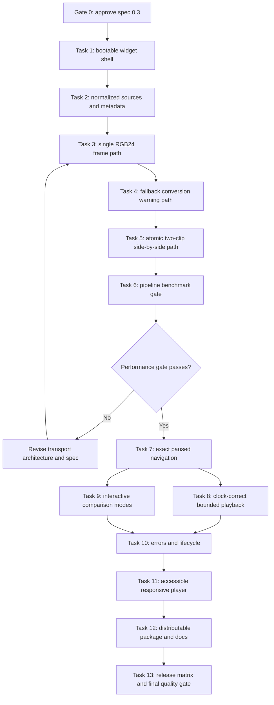

# Kaleidoscope Implementation Plan

Status: T1-T7 complete; G1 approved; Tasks T8 and T9 next
Source: `tasks/spec.md`, revision 0.5 approved
Planning scope: G1 is approved; Tasks T7-T13 may proceed in dependency order

## 1. Preconditions and Assumptions

Implementation must not begin until the approval gate in `tasks/spec.md` is resolved. This plan assumes the approved contract remains:

- Kernel-backed anywidget architecture.
- Python 3.12+, VapourSynth 77 baseline, anywidget 0.11.x.
- Direct clips, ordered collections, labeled mappings, and snapshots of registered outputs.
- Caller-prepared `RGB24` as the authoritative path, with warned automatic conversion as a fallback.
- Atomic synchronized frame sets for all multi-clip views.
- JPEG-default image transport with caller-selectable JPEG/WebP compression, as approved at G1.
- Original clip resolution is preserved; preview resizing is performed upstream by the caller.
- Linux-first local notebooks, without audio, VFR, variable resolution, or `.vpy` execution.

Repository observations:

- The repository has no product source, build configuration, or tests yet.
- The only product artifact is the specification, so there are no existing implementation conventions to preserve.
- The files under `.agents/` are workflow support and are outside the product implementation scope.

Working rules for every implementation task:

1. Use test-driven development: add a failing behavior test before implementation where behavior is involved.
2. Verify framework-specific decisions against current official documentation before coding.
3. Keep protocol types and validation symmetric between Python and TypeScript.
4. Leave the repository buildable and the completed slices working after every task.
5. Update the spec before implementation if a benchmark or API discovery changes an approved contract.
6. Do not pull deferred-roadmap features into the MVP.

## 2. Verification Command Contract

Task 1 establishes these stable commands so later tasks have predictable verification:

| Purpose | Command contract |
| --- | --- |
| Targeted/full Python tests | `hatch run test:pytest [test paths or pytest args]` |
| Python lint/format check | `hatch run lint:check` |
| Python type check | `hatch run types:check` |
| Targeted/full frontend tests | `npm test -- --run [test paths or Vitest args]` |
| Frontend type/build check | `npm run build` |
| Browser end-to-end tests | `npm run test:e2e -- [Playwright args]` |
| Python artifacts | `hatch build` |

If a tool cannot support this exact spelling, Task 1 may amend the command contract in this document before subsequent tasks begin.

## 3. Dependency Graph

Critical path: `G0 -> T1 -> T2 -> T3 -> T4 -> T5 -> T6 -> G1 -> T7 -> T8/T9 -> T10 -> T11 -> T12 -> T13`.

## 4. Vertical Implementation Tasks

## T1: Bootable Packaged Widget Shell

**Dependencies:** G0 (approved spec revision 0.3).

**Description:** Create the smallest installable Python/TypeScript package that proves the entire packaging boundary. A Python `PreviewWidget` must load its bundled anywidget frontend, complete the `ready` handshake, exchange typed protocol-v1 metadata through a fake session, and render a visible initialized state. This slice establishes build, lint, type-check, test, and artifact commands used by every later task.

**Primary surfaces:** `pyproject.toml`, `package.json`, lockfile, TypeScript configuration, `src/kaleidoscope/{__init__,widget,protocol}.py`, `frontend/{index,protocol,styles}.ts/css`, initial Python/frontend tests.

**Acceptance criteria:**

- [ ] `kaleidoscope` imports from the source tree and exposes `PreviewWidget` plus a placeholder `preview()` entry point.
- [ ] The frontend registers custom-message listeners, probes WebP through `createImageBitmap(Blob)`, and then sends `ready`.
- [ ] Python sends initial metadata only after an accepted `ready`; pre-ready requests, unsupported decoders/codecs, duplicate handshakes, and incompatible protocol versions close the session with a terminal error.
- [ ] Protocol-v1 discriminated message types exist in Python and TypeScript with matching required fields.
- [ ] The frontend renders an initialized placeholder without a CDN or runtime network request.
- [ ] ESM and CSS assets are generated into `src/kaleidoscope/static/` and included in wheel/sdist builds.
- [ ] The verification command contract in Section 2 works.

**Verification:**

- [ ] `hatch run test:pytest tests/python/test_protocol.py tests/python/test_widget.py`
- [ ] `npm test -- --run tests/frontend/protocol.test.ts tests/frontend/widget.test.ts`
- [ ] `hatch run lint:check && hatch run types:check`
- [ ] `npm run build && hatch build`

## T2: Normalized Sources and Visible Metadata

**Dependencies:** T1.

**Description:** Make `preview()` useful for source discovery before rendering pixels. A caller can pass one node, a sequence, a labeled mapping, or no argument to snapshot registered outputs; the widget displays stable clip labels and shared timeline metadata, while invalid inputs fail synchronously with the specified error codes.

**Primary surfaces:** `src/kaleidoscope/{api,sources,widget,protocol}.py`, frontend metadata presentation, source/API/protocol tests.

**Acceptance criteria:**

- [ ] A single node, sequence, and insertion-ordered mapping normalize to one immutable ordered clip collection.
- [ ] `clips=None` snapshots sorted registered video outputs without mutating the registry.
- [ ] Registered audio is ignored and the absence of video outputs raises `no_video_outputs`.
- [ ] Clip IDs and labels remain stable in Python metadata and the rendered clip list.
- [ ] Positive dimensions, frame count, constant format, rational FPS, matching timelines, mode cardinality, selected IDs, and active-clip limits are validated.
- [ ] Side-by-side accepts differing fixed dimensions; aligned modes reject mismatched source dimensions.
- [ ] Errors use stable machine-readable codes and safe user-facing text.

**Verification:**

- [ ] `hatch run test:pytest tests/python/test_api.py tests/python/test_sources.py tests/python/test_protocol.py`
- [ ] `npm test -- --run tests/frontend/protocol.test.ts tests/frontend/player.test.ts`
- [ ] Real VapourSynth integration test covers direct nodes and sparse registered outputs when VapourSynth is available.

## T3: Single RGB24 Frame End to End

**Dependencies:** T2.

**Description:** Deliver the first real preview pixel through the complete runtime path. A caller-prepared constant `RGB24` clip is used directly, frame 0 is requested asynchronously, its strided planar data is adapted and encoded, a binary frame message crosses the widget comm, and the browser decodes and paints it to a canvas.

**Primary surfaces:** `src/kaleidoscope/{session,frame_adapter,encoding,protocol,widget}.py`, `frontend/{player,protocol}.ts`, generated clip fixtures and pipeline tests.

**Acceptance criteria:**

- [ ] An `RGB24` node is reused directly at its original dimensions.
- [ ] `get_frame_async(0)` drives rendering without an unbounded executor.
- [ ] Padded plane strides are copied correctly into interleaved RGB bytes.
- [ ] Configured JPEG or WebP encoding produces a MIME-typed binary payload with bounded declared length.
- [ ] The frontend validates metadata and payload length, decodes JPEG and WebP through `createImageBitmap(Blob)`, and paints frame 0.
- [ ] `VideoFrame`, `Blob`, object URL, and `ImageBitmap` resources are released in success, error, and stale paths.
- [ ] A generated known-color clip produces the expected canvas pixels in a real browser.

**Verification:**

- [ ] `hatch run test:pytest tests/python/test_frame_adapter.py tests/python/test_encoding.py tests/python/test_session.py -m "not vapoursynth or vapoursynth"`
- [ ] `npm test -- --run tests/frontend/player.test.ts tests/frontend/protocol.test.ts`
- [ ] `npm run test:e2e -- --grep "paints an RGB24 frame"`

## T4: Warned Automatic RGB24 Fallback

**Dependencies:** T3.

**Description:** Complete the compatibility path for users who pass a constant non-`RGB24` clip. The backend builds one format-only fallback conversion node at the source dimensions, carries structured warnings through metadata, and the player visibly associates those warnings with the active clip while still painting the preview.

**Primary surfaces:** source preparation in `sources.py` or a focused preparation module, warning protocol, player warning UI, Python/frontend/E2E tests.

**Acceptance criteria:**

- [ ] Caller-prepared `RGB24` remains the warning-free direct path.
- [ ] Caller-prepared `RGB24` remains unchanged in format and dimensions and emits no automatic-conversion warning.
- [ ] A constant non-`RGB24` clip gets exactly one format-conversion graph node targeting `RGB24` at the source dimensions.
- [ ] `automatic_rgb24_conversion` identifies the source format and recommends explicit upstream conversion.
- [ ] `assumed_color_metadata` lists matrix, transfer, and range defaults when source metadata is incomplete.
- [ ] Warnings are visible text, clip-specific, accessible, and non-fatal.
- [ ] Conversion failure reports `conversion_failed` without exposing unsafe HTML.

**Verification:**

- [ ] `hatch run test:pytest tests/python/test_sources.py tests/python/test_encoding.py -k "rgb24 or conversion or warning"`
- [ ] `npm test -- --run tests/frontend/player.test.ts -t "conversion warning"`
- [ ] `npm run test:e2e -- --grep "automatic RGB24 conversion warning"`

## T5: Atomic Two-Clip Side-by-Side Preview

**Dependencies:** T4.

**Description:** Extend the proven single-frame path into the core comparison invariant. Two compatible clips are requested at the same frame number, encoded separately, delivered as one manifest plus multiple binary buffers, staged in the browser, and committed together in a labeled side-by-side view.

**Primary surfaces:** `src/kaleidoscope/{session,scheduler,protocol,encoding}.py`, `frontend/{player,comparison,protocol}.ts`, multi-clip fixtures and tests.

**Acceptance criteria:**

- [ ] A logical request contains one generation, request ID, frame number, and ordered active clip-ID set.
- [ ] Backend delivery waits for all requested clips and emits one validated `frame_set` manifest.
- [ ] Buffer indices are unique, ordered deterministically, and checked against per-buffer and total payload bounds.
- [ ] The frontend decodes into staging and atomically replaces the displayed set only when every member is ready.
- [ ] One missing, duplicate, stale, failed, or undecodable member prevents a partial commit.
- [ ] Both labeled canvases show the same requested frame in an end-to-end generated-pattern test.
- [ ] A slow member keeps the last complete set visible while the new set buffers.

**Verification:**

- [ ] `hatch run test:pytest tests/python/test_protocol.py tests/python/test_scheduler.py tests/python/test_session.py -k "frame_set or atomic or fair"`
- [ ] `npm test -- --run tests/frontend/protocol.test.ts tests/frontend/comparison.test.ts -t "atomic"`
- [ ] `npm run test:e2e -- --grep "atomic side-by-side"`

## T6: Pipeline Benchmark and Architecture Gate

**Dependencies:** T5.

**Description:** Measure the complete one-, two-, and four-clip path before building the full player. Record render, conversion, interleave, encode, payload, frame-set wait, comm, decode, and paint costs; compare JPEG 4:2:0/4:4:4, lossy/lossless WebP, and NumPy/buffer-only implementations; then either lock the MVP choices or stop and revise the transport architecture.

**Primary surfaces:** `benchmarks/{clips,pipeline,memory}.py`, browser benchmark harness, benchmark report under `docs/` or `tasks/`, dependency decisions in the spec/build files.

**Acceptance criteria:**

- [x] Benchmark inputs, machine details, resolutions, quality settings, warm-up, sample counts, and percentile calculations are reproducible.
- [x] Caller-prepared RGB24 and fallback conversion costs are measured separately.
- [x] JPEG 4:2:0/4:4:4 and lossy/lossless WebP are compared where Pillow/browser support is reliable.
- [x] NumPy and a viable buffer-only plane interleave are compared before NumPy becomes permanent.
- [x] One 1280x720 paused preview targets median under 150 ms and p95 under 250 ms.
- [x] Two 960x540 paused previews target median under 225 ms and p95 under 350 ms.
- [x] Playback feasibility is measured for one/two/four active clips, including bytes, CPU, lag, and drops.
- [x] A written decision records the default and selectable codec modes, quality/lossless semantics, source-resolution policy, interleave dependency, and whether the image protocol remains viable.
- [x] Targets pass, so no transport revision is required before G1.

**Verification:**

- [x] Benchmark command completes and writes raw plus summarized results.
- [x] Results can be reproduced from a clean environment using documented commands.
- [x] Human approves the gate decision before Task 7 begins.

## T7: Exact Paused Navigation

**Dependencies:** T6 and G1 passing.

**Description:** Turn the static preview into a precise inspection tool while paused. The user can seek with the timeline, frame/time entry, step buttons, and first/last actions; high-frequency scrubbing is coalesced and only the latest complete synchronized frame set may paint.

**Primary surfaces:** `frontend/{player,scheduler,time}.ts`, `src/kaleidoscope/{session,scheduler,protocol}.py`, control styling and navigation tests.

**Acceptance criteria:**

- [x] Frame 0, an arbitrary middle frame, and the last frame resolve exactly for every active clip.
- [x] Timeline drag updates optimistic frame/time text immediately and temporarily pauses playback intent.
- [x] Slider release, numeric frame entry, and time entry request the exact clamped target.
- [x] Previous/next and Home/End controls work while paused and have scoped keyboard equivalents.
- [x] Rational FPS conversion avoids float-boundary errors.
- [x] Scrub requests are coalesced latest-wins; obsolete generations never overwrite the final target.
- [x] Paused seeks never substitute a neighboring frame.

**Verification:**

- [x] `hatch run test:pytest tests/python/test_scheduler.py tests/python/test_protocol.py tests/python/test_session.py -k "seek or generation or coalesce or stale or exact_boundary or non_monotonic"`
- [x] `npm test -- --run tests/frontend/player.test.ts tests/frontend/scheduler.test.ts tests/frontend/time.test.ts tests/frontend/comparison.test.ts tests/frontend/widget.test.ts`
- [x] `npm run test:e2e`

## T8: Clock-Correct Bounded Playback

**Dependencies:** T7.

**Description:** Add play/pause behavior without sacrificing exactness or bounded resource use. The browser owns the rational playback clock, the backend fairly schedules active clips, obsolete playback sets are dropped, delivery is ACK-gated, and a bounded per-session LRU supports nearby frames and loop restarts.

**Primary surfaces:** frontend player/scheduler, Python session/scheduler/cache, trait status, playback and performance tests.

**Acceptance criteria:**

- [ ] Play/pause, autoplay-after-ready, end pause, and replay-from-zero behavior match the spec.
- [ ] Desired frame comes from a clock anchor rather than chained timer increments.
- [ ] Playback order is monotonic except after an explicit seek or restart.
- [ ] Total submitted clip-frame futures never exceed `max_in_flight` and active clips receive fair scheduling.
- [ ] At most one delivered frame set is unacknowledged by default.
- [ ] ACK outcomes `painted`, `stale`, and `decode_error` drive delivery correctly.
- [ ] The latest desired playback set replaces obsolete queued work; unavoidable stale completions cannot paint.
- [ ] The per-session LRU enforces count and byte budgets and never stores open `VideoFrame` objects.
- [ ] Hidden documents pause and resume only when playback was active before hiding.

**Verification:**

- [ ] `hatch run test:pytest tests/python/test_scheduler.py tests/python/test_lifecycle.py -k "playback or ack or cache or bound or fair"`
- [ ] `npm test -- --run tests/frontend/player.test.ts tests/frontend/scheduler.test.ts -t "playback|visibility|ack"`
- [ ] `npm run test:e2e -- --grep "play pause|slow playback|visibility"`

## T9: Interactive Comparison Modes

**Dependencies:** T7. May proceed in parallel with T8 only after the frame-set and view-state protocol is frozen; both tasks modify player state and require coordination.

**Description:** Let users select clips and switch among every MVP comparison mode using already decoded synchronized images. Single and side-by-side views change the active set; wipe, overlay, and difference reuse the same A/B frame images without a kernel rerender.

**Primary surfaces:** `frontend/{comparison,player,styles}.ts/css`, view protocol handling, Python selection validation, comparison unit/E2E tests.

**Acceptance criteria:**

- [ ] `auto`, `single`, and one-to-four-clip side-by-side modes select deterministic defaults and preserve normalized order.
- [ ] Pair modes enforce distinct A/B clips and identical source geometry.
- [ ] Wipe uses a draggable and keyboard-operable vertical divider with aligned canvases.
- [ ] Overlay adjusts B opacity from 0 through 1.
- [ ] Difference uses documented 8-bit browser compositing and is labeled non-reference.
- [ ] Switching wipe/overlay/difference for an unchanged pair sends no frame request and performs no re-encode.
- [ ] Changing active clips increments generation and retires incomplete prior sets.
- [ ] Clip labels and active conversion warnings remain associated with the correct view.

**Verification:**

- [ ] `hatch run test:pytest tests/python/test_api.py tests/python/test_protocol.py -k "mode or visible or primary or secondary"`
- [ ] `npm test -- --run tests/frontend/comparison.test.ts tests/frontend/player.test.ts`
- [ ] `npm run test:e2e -- --grep "single|side-by-side|wipe|overlay|difference"`

## T10: Recoverable Errors and Complete Lifecycle

**Dependencies:** T8 and T9.

**Description:** Make the complete player resilient in normal notebook failure modes. Clip-specific render/conversion/encode/decode errors preserve the last complete synchronized set, kernel disconnect is visible, closing or removing a view releases resources, and multiple widgets remain independent.

**Primary surfaces:** Python session/widget/lifecycle, frontend state/error handling, cleanup and multi-widget tests.

**Acceptance criteria:**

- [ ] Stable error codes cover validation, render, conversion, encode, decode, protocol, disconnect, and closed-session failures.
- [ ] A failed member identifies its clip and never causes a partial new comparison paint.
- [ ] Recoverable failures pause playback, retain the last complete set, and allow retry or seek.
- [ ] Decode failure ACKs `decode_error` and releases all staged browser resources.
- [ ] Widget close clears caches, marks the session closed, ignores late futures, and is idempotent.
- [ ] anywidget `AbortSignal` removes DOM and model listeners and stops further sends after view removal.
- [ ] Kernel disconnect shows a paused disconnected state with the last complete set retained.
- [ ] Multiple widgets have independent sessions, caches, generations, selections, and playback state.
- [ ] Exception content is inserted only as text and logs do not include pixel buffers or notebook source.

**Verification:**

- [ ] `hatch run test:pytest tests/python/test_lifecycle.py tests/python/test_session.py -k "error or close or late or multiple"`
- [ ] `npm test -- --run tests/frontend/player.test.ts -t "error|disconnect|cleanup"`
- [ ] `npm run test:e2e -- --grep "render error|disconnect|two widgets|removal"`

## T11: Accessible Responsive Notebook Player

**Dependencies:** T10.

**Description:** Finish the user-facing player so it remains compact, legible, keyboard-operable, and stable across notebook widths and themes. This task hardens the complete workflows rather than adding new rendering behavior.

**Primary surfaces:** frontend DOM structure and CSS, bundled icons, accessibility/browser tests.

**Acceptance criteria:**

- [ ] Native buttons, ranges, numeric inputs, segmented modes, selectors, and tooltips expose accessible names and selected states.
- [ ] Space, arrows, Home/End, and F are scoped to the focused player and do not intercept editable inputs or notebook shortcuts.
- [ ] Wipe position, overlay opacity, active warnings, frame/time, status, and clip labels have accessible text equivalents.
- [ ] Warning/status changes use a polite live region and never rely on color alone.
- [ ] Focus rings and text/control contrast meet WCAG AA in light and dark notebook themes.
- [ ] Controls use one or two stable rows without overlap at narrow widths; canvas geometry and toolbars do not shift as state changes.
- [ ] Fullscreen enters/exits through the browser API and has a graceful unsupported state.
- [ ] Reduced-motion preference disables nonessential motion.
- [ ] Browser screenshots at narrow, common desktop, and fullscreen sizes show no clipping or incoherent overlap.

**Verification:**

- [ ] `npm test -- --run tests/frontend/player.test.ts tests/frontend/comparison.test.ts -t "keyboard|accessible|responsive|fullscreen"`
- [ ] `npm run test:e2e -- --grep "keyboard|accessibility|responsive|fullscreen"`
- [ ] Automated accessibility scan reports no serious/critical issues; manual keyboard and screen-reader smoke checks are recorded.
- [ ] Browser console is clean and canvas pixel checks confirm nonblank correctly framed output.

## T12: Distributable Package, Examples, and Documentation

**Dependencies:** T11.

**Description:** Produce installable artifacts and documentation that let a new user set up VapourSynth, install Kaleidoscope, preview a single clip, discover registered outputs, compare clips, understand RGB24 warnings, and troubleshoot common errors without runtime network access.

**Primary surfaces:** packaging configuration, `README.md`, `LICENSE`, `docs/{installation,usage,architecture}.md`, `examples/quickstart.ipynb`, `py.typed`, artifact tests.

**Acceptance criteria:**

- [ ] Wheel and sdist include Python code, type marker, built ESM/CSS, license, and required metadata.
- [ ] Frontend source and `node_modules` are not unintentionally shipped.
- [ ] Clean installs from wheel and sdist import and render single-clip and two-output smoke previews.
- [ ] No runtime CDN, analytics, server listener, or external request is required.
- [ ] Installation docs clearly separate system VapourSynth prerequisites from Python package installation.
- [ ] Usage docs cover direct clips, sequences/mappings, registered outputs, all comparison modes, sizing/quality, warnings, and cleanup.
- [ ] Architecture docs explain ownership, protocol, atomic frame sets, backpressure, caches, security boundary, and benchmark decisions.
- [ ] The quickstart notebook uses generated media and can run without external source files/plugins.
- [ ] Saved output does not persist streamed frame buffers as durable playable state.

**Verification:**

- [ ] `npm run build && hatch build`
- [ ] Artifact-content inspection passes for wheel and sdist.
- [ ] Clean-environment wheel and sdist smoke scripts pass without network access.
- [ ] Notebook smoke execution completes where a compatible kernel is available.

## T13: Compatibility Matrix and Final Quality Gate

**Dependencies:** T12.

**Description:** Automate repeatable quality gates and prove the release candidate across the supported notebook hosts. The task finishes with a reviewable compatibility/benchmark report and an explicit release or hold decision.

**Primary surfaces:** GitHub Actions workflows, Playwright/Jupyter harness, compatibility checklist, benchmark report, release notes/checklist.

**Acceptance criteria:**

- [ ] CI runs lint, type checks, Python unit tests, frontend tests, build, and artifact inspection on every change.
- [ ] Python 3.12 and 3.13 are covered; VapourSynth 77 is the baseline and the next stable is tested before widening constraints where installation is reliable.
- [ ] At least one CI job exercises the real Jupyter comm path in JupyterLab 4.
- [ ] Notebook 7 receives an automated or documented reproducible smoke test.
- [ ] Current VS Code Jupyter behavior has a completed manual release checklist unless stable automation is available.
- [ ] Chromium E2E passes and Firefox receives a manual smoke test.
- [ ] Protocol, scheduler, cache, and lifecycle modules meet the 90% branch-coverage target.
- [ ] Performance and memory suites report no acceptance-target regression or monotonic leak.
- [ ] A final code-quality review finds no unresolved correctness, security, lifecycle, accessibility, packaging, or test blockers.
- [ ] PyPI name availability and the MIT license choice are confirmed before publication.

**Verification:**

- [ ] All local canonical commands pass from a clean checkout/environment.
- [ ] CI required checks pass on the release candidate.
- [ ] Compatibility, benchmark, accessibility, and manual host checklists are attached to the release decision.

## 5. Parallelization Opportunities

Safe or conditionally safe parallel work:

- After Task 7, Task 8 (playback/backpressure) and Task 9 (comparison composition) may run in parallel only after freezing shared protocol and player-state contracts. They both touch `player.ts`, scheduler/view state, and protocol tests, so ownership must be explicit.
- During Task 11, a separate browser-testing pass may verify accessibility, responsive layout, screenshots, console output, and canvas pixels against a stable build.
- During Task 12, installation/usage documentation can proceed alongside artifact smoke-test work after public APIs and command names are frozen.
- During Task 13, CI workflow work and manual host-matrix execution can proceed in parallel against the same release candidate.

Work that must remain sequential:

- Tasks 1-6 form the architecture-validation path and should not be parallelized.
- Task 7 must wait for the Task 6 performance decision.
- Error/lifecycle hardening waits for both playback and comparison behavior.
- Packaging and host validation wait for stable behavior and frontend assets.

## 6. Requirement Coverage

| Specification area | Owning task(s) |
| --- | --- |
| Package/build/anywidget handshake | Task 1 |
| Public API, source normalization, registry snapshot, validation | Task 2 |
| Caller-owned RGB24 frame path and encoding | Task 3 |
| Non-RGB24 fallback and UI warnings | Task 4 |
| Atomic synchronized multi-buffer frame sets | Task 5 |
| Encoder/interleave/transport performance decisions | Task 6 |
| Exact seek, frame/time entry, stepping, first/last | Task 7 |
| Play/pause, clock, dropping, fairness, ACK, cache, visibility | Task 8 |
| Single, side-by-side, wipe, overlay, difference, clip selectors | Task 9 |
| Errors, disconnect, close, cleanup, multiple widgets | Task 10 |
| Keyboard, accessibility, themes, responsive layout, fullscreen | Task 11 |
| Wheel/sdist, examples, user and architecture docs | Task 12 |
| CI, host matrix, coverage, benchmarks, release review | Task 13 |

## 7. Decision Gates and Stop Conditions

### Gate 0: Product Approval

Before Task 1, approve or amend the checklist in `tasks/spec.md`, including package name, license, RGB24 policy, comparison semantics, target hosts, and performance goals.

### Gate 1: Pipeline Viability

After Task 6, stop if image-per-frame transport cannot approach the single- and two-clip latency/playback targets without unsafe resource use. Revise the spec and plan before evaluating continuous chunks, WebCodecs, shared memory, or a worker/server architecture.

### Gate 2: Release Readiness

After Task 13, hold release for any correctness issue involving stale/partial paints, resource leaks, protocol bounds, broken clean installs, inaccessible core controls, or failure on the required JupyterLab comm path. Performance results outside targets require an explicit documented exception rather than silent release.

## 8. Human Review Checklist

- [ ] The vertical slices and their acceptance criteria match the intended MVP.
- [ ] The dependency graph and mandatory benchmark gate are acceptable.
- [ ] The proposed verification command contract is acceptable.
- [ ] Task 8 and Task 9 may be parallelized under a frozen shared contract, or should be kept sequential.
- [ ] No deferred-roadmap feature has entered the implementation plan.
- [ ] The plan may become the implementation sequence after the spec approval gate is closed.