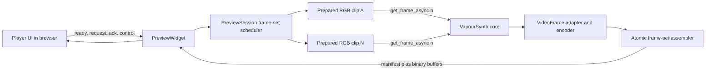

# Kaleidoscope: Real-Time VapourSynth Preview for Jupyter

Status: T6 benchmark amendment awaiting G1 approval
Spec revision: 0.4 draft
Research baseline: July 2026

## 1. Approval Gate

This document is the implementation contract for the first release. No package scaffolding, dependency installation, or product code should begin until the user approves this spec or requests revisions.

The user delegated unanswered product decisions to the implementer. Those decisions are marked **Proposed** and remain reviewable at approval time.

Revision 0.4 records the Task 6 benchmark selections for encoding, interleave, and transport. They are implemented and measured, but Task 7 must not begin until the user approves them at G1.

Approval should confirm these consequential choices:

1. Build a portable inline Jupyter widget rather than a Jupyter server extension.
2. Accept one or more live `vapoursynth.VideoNode` objects directly, or snapshot the video entries registered through `set_output()`.
3. Target local, Linux-first, constant-frame-rate preview without audio for the MVP.
4. Include synchronized single, side-by-side, wipe, opacity-overlay, and difference comparison modes in the MVP.
5. Expect callers to supply `RGB24` clips; provide automatic RGB24 conversion only as a visible, warned fallback.
6. Stream an atomic set of individually encoded preview frames, initially JPEG, rather than a continuous video stream.
7. Treat "real time" as clock-correct playback with bounded latency and frame dropping, not guaranteed full-rate rendering for every VapourSynth graph.
8. Use the proposed package name `kaleidoscope` and MIT license.

## 2. Objective

Create a Python package that lets notebook users inspect and compare live VapourSynth clips in an inline player with familiar transport controls. The player must support play, pause, seek, single-frame stepping, frame/time readouts, synchronized multi-output comparison, and resilient interaction while frames are rendered asynchronously by the notebook kernel.

A typical workflow should be:

```python
import vapoursynth as vs
from kaleidoscope import preview

clip: vs.VideoNode = build_clip()
player = preview(clip)
player
```

VapourSynth's registered outputs should work without rebuilding a separate collection:

```python
source.set_output(0)
filtered.set_output(1)

comparison = preview(mode="wipe")
comparison
```

Users who do not use the output registry can supply descriptive labels directly:

```python
comparison = preview(
    {"Source": source, "Filtered": filtered},
    mode="side-by-side",
)
```

The result should render in JupyterLab 4, Jupyter Notebook 7, and VS Code notebooks without requiring users to install a separate frontend extension.

### 2.1 Target users

- VapourSynth script authors iterating in notebooks.
- Video engineers comparing source, filtered, encoded, or alternate pipeline outputs at exact synchronized frames.
- Researchers who need a lightweight interactive viewer for generated clips.

### 2.2 Definition of "real time"

For this project, real time means:

- The browser maintains one playback clock shared by the active clips at their common declared constant frame rate.
- The renderer requests synchronized frame sets near the clock's desired position.
- Obsolete frame sets are dropped when rendering cannot keep pace.
- User controls remain responsive and paused seeks resolve to the exact requested frame across every active clip.

It does not mean that an arbitrarily expensive VapourSynth graph is guaranteed to render every frame at source frame rate.

## 3. Scope

### 3.1 MVP capabilities

- Display one or more live `VideoNode` objects inline.
- Discover all registered video outputs from a snapshot of `vapoursynth.get_outputs()` when `preview()` is called without an explicit clip argument.
- Preserve output indices or caller-provided names as stable clip labels.
- Prefer caller-prepared, fixed-format `RGB24` clips and provide a warned automatic conversion fallback for other constant formats.
- Switch among single, side-by-side, wipe, opacity-overlay, and difference comparison modes.
- Select up to four clips for simultaneous side-by-side display and two clips for aligned comparison modes.
- Keep transport, seeking, and displayed frame numbers synchronized across active clips.
- Play and pause.
- Seek by timeline, frame number, or time entry.
- Step backward and forward by one frame while paused.
- Jump to first and last frame.
- Show current frame, total frames, current time, duration, dimensions, and FPS.
- Keyboard-accessible controls and shortcuts when the player has focus.
- Fit the preview responsively while preserving source aspect ratio.
- Offer preview resolution and quality controls through Python options.
- Surface loading, buffering, end-of-clip, disconnected-kernel, and render-error states.
- Dispose resources when the widget closes or its view is removed.
- Support multiple independent players in one kernel, within configured resource limits.

### 3.2 Explicit non-goals for MVP

- Audio extraction, synchronization, or playback.
- Executing or sandboxing arbitrary `.vpy` files.
- A standalone VS Code extension, native desktop application, or Jupyter server extension.
- Remote/cloud notebook optimization or WAN streaming guarantees.
- Variable-frame-rate timing.
- Variable-resolution clips.
- HDR-accurate display or color-managed reference monitoring.
- Scopes, frame properties, pixel inspection, or annotations.
- Using `VideoOutputTuple.alpha` or `alt_output` packing semantics; comparison overlays blend the normalized RGB previews in the browser.
- Export/render queue features.
- CDN-loaded frontend dependencies, telemetry, or external services.
- Guaranteed interaction while the kernel is occupied by unrelated blocking Python code.

## 4. Product Behavior

### 4.1 Public Python API

The initial public surface should stay small:

```python
from collections.abc import Mapping, Sequence
from typing import Literal, TypeAlias

ClipId: TypeAlias = int | str
ClipInput: TypeAlias = (
    "vapoursynth.VideoNode"
    | Sequence["vapoursynth.VideoNode"]
    | Mapping[ClipId, "vapoursynth.VideoNode"]
)
ComparisonMode: TypeAlias = Literal[
    "auto",
    "single",
    "side-by-side",
    "wipe",
    "overlay",
    "difference",
]

def preview(
    clips: ClipInput | None = None,
    *,
    mode: ComparisonMode = "auto",
    primary: ClipId | None = None,
    secondary: ClipId | None = None,
    visible: Sequence[ClipId] | None = None,
    overlay_opacity: float = 0.5,
    max_visible_clips: int = 4,
    width: int | None = None,
    height: int | None = 720,
    quality: int = 80,
    cache_size: int = 32,
    max_in_flight: int = 4,
    autoplay: bool = False,
) -> "PreviewWidget": ...
```

`PreviewWidget` should also be constructible directly for advanced use, but `preview()` is the documented entry point.

Validation rules:

- `clips` may be one `VideoNode`, an ordered sequence, or an insertion-ordered mapping from a unique string/integer ID to a `VideoNode`.
- `clips=None` snapshots `vapoursynth.get_outputs()`, sorts integer output indices, keeps video outputs, and uses labels such as `Output 0`. Registered audio outputs are ignored with a debug log entry; no video outputs is an error.
- Output discovery does not mutate the VapourSynth registry and is not live. Outputs added or replaced later require a new widget.
- Every clip must have known, positive `num_frames`, width, height, constant format, and constant FPS. The MVP rejects variable-format or variable-resolution clips with a clear error.
- Callers are expected to perform color conversion explicitly and supply `RGB24` when they need control over matrix, transfer, range, chroma handling, dithering, or other conversion details.
- A constant-format non-`RGB24` clip remains usable through the extension's automatic RGB24 fallback. The widget must show a visible clip-specific warning that identifies the original format and recommends explicit upstream conversion.
- A multi-clip session requires identical rational FPS and `num_frames` across all supplied clips. This avoids ambiguous synchronization or silent clamping; users can trim or retime clips explicitly before previewing them together.
- Side-by-side mode permits different fixed dimensions and aspect ratios. Wipe, overlay, and difference modes require the selected pair to have identical source dimensions for meaningful pixel alignment.
- `mode="auto"` selects `single` for one clip and `side-by-side` for multiple clips.
- `single` requires at least one clip. `side-by-side` requires at least one selected clip. Wipe, overlay, and difference require at least two supplied clips and two distinct selected clip IDs.
- `primary` selects the initial single view and the A layer for pair modes. `secondary` selects the B layer. `visible` selects the initial side-by-side set; defaults are deterministic from input order.
- Supplied IDs must resolve to normalized clips. Pair-mode defaults use the first two clips in input order, and `secondary` must differ from `primary`.
- All supplied clips remain selectable, but no more than `max_visible_clips` may be rendered simultaneously; the MVP permits values from 1 through 4.
- `overlay_opacity` must be between 0 and 1 and controls the B layer in overlay mode.
- Width/height options control preview-only resizing after RGB24 preparation and preserve each clip's aspect ratio; if both are supplied, each clip is contained within that box. Preview dimensions should not upscale a source by default.
- `quality` is clamped or rejected outside a documented range.
- `cache_size >= 0` and `max_in_flight` is restricted to a small safe range, initially 1-16. `max_in_flight` counts total submitted clip-frame renders, not logical frame sets.
- `autoplay=True` begins only after the frontend sends `ready`; browser autoplay policy is not relevant because the MVP has no audio.

The widget should expose read-only low-rate metadata/status traits for notebook introspection, such as `current_frame`, `playing`, `mode`, `active_clip_ids`, `status`, and `last_error`. High-rate frame payloads must not be synchronized traits.

### 4.2 Controls

The compact control bar should contain:

- Play/pause icon button.
- Previous-frame and next-frame icon buttons.
- Seek slider spanning frame `0` through `num_frames - 1`.
- Editable current frame field and total-frame label.
- Current time and duration.
- Comparison mode segmented control when more than one clip is available.
- A solo clip selector, a side-by-side multi-selector, or distinct A/B selectors according to the current mode.
- An opacity slider in overlay mode and a draggable, keyboard-operable divider in wipe mode.
- Buffering/status indicator.
- A compact warning indicator and accessible warning summary when an active clip uses automatic RGB24 conversion.
- Fullscreen button using the browser Fullscreen API when available.

Buttons use familiar icons with accessible names and tooltips. **Proposed:** use Lucide icons bundled at build time; if bundle size is disproportionate, replace them with a minimal local icon set before release.

### 4.3 Comparison semantics

- A logical frame request targets one frame number and an ordered set of active clip IDs.
- The frontend stages decoded images and commits them as one frame set only after every requested clip is ready. It must never display frame `n` from one clip beside frame `n - 1` from another after a synchronized request.
- `single` shows one selected clip.
- `side-by-side` shows one through four selected clips in a responsive labeled grid with equal visual priority.
- `wipe` stacks A and B and reveals B across a draggable vertical divider. Both clips must use the same normalized canvas geometry.
- `overlay` stacks A and B with adjustable B opacity from 0 through 1.
- `difference` uses browser canvas difference compositing on the 8-bit SDR preview images. It is a visual diagnostic, not a linear-light or reference-grade metric.
- Switching among wipe, overlay, and difference for the same A/B pair is frontend-only and must not request or encode the frames again.
- Changing the active clip set increments the request generation and retires incomplete sets from the previous selection.
- If one member of a frame set fails, the last complete synchronized set remains visible and the failed clip is identified. The frontend must not commit a partial new set.
- Stable clip labels remain visible in every multi-clip mode and are included in accessible descriptions.

### 4.4 Keyboard interaction

When focus is within the player:

- `Space`: play/pause, unless editing an input.
- `ArrowLeft` / `ArrowRight`: previous/next frame while paused; seek by one second with a modifier.
- `Home` / `End`: first/last frame.
- `F`: enter or exit fullscreen.

Shortcuts must not intercept notebook commands when the player is unfocused. Every operation must also be available through visible controls.

### 4.5 Seeking semantics

- Dragging the seek slider pauses playback temporarily and updates the frame/time preview immediately.
- Requests during scrubbing are coalesced; the newest target wins.
- Releasing the slider requests the exact target for every active clip and restores the prior playing state only after that complete frame set is accepted.
- Numeric entry is clamped to the valid range and requests that exact frame.
- While paused, no active clip is silently substituted with a neighboring frame.
- At end of the shared clip timeline, playback pauses on the last frame. Pressing play again restarts from frame 0.

### 4.6 Visibility and lifecycle

- Playback pauses when the document becomes hidden; automatic resume occurs only if playback was active before hiding.
- The frontend sends `ready` after all custom-message listeners are registered. Python must not send the initial frame before this handshake because early custom messages can be lost.
- The frontend uses the lifecycle `AbortSignal` supplied by anywidget for DOM listeners and unregisters model listeners on abort.
- Closing the widget marks the session closed, clears all per-clip encoded-frame caches, ignores late futures, and releases held `VideoFrame`, frame-set, and image resources.
- Kernel disconnect places the player in a paused disconnected state while retaining the last complete painted frame set.

## 5. Functional and Performance Requirements

### 5.1 Correctness

- Frame 0, an arbitrary middle frame, and the final frame must be seekable exactly across every active clip.
- Playback order is monotonic except after an explicit seek or loop restart.
- A response from an obsolete seek/playback generation must never replace a newer requested frame set.
- A synchronized paint must contain the same requested frame number and generation for every active clip.
- Clip IDs and labels must remain stable from input normalization through metadata, cache keys, errors, selectors, and frame-set delivery.
- Wipe, overlay, and difference must use the same canvas dimensions and pixel origin for A and B.
- All acquired VapourSynth `VideoFrame` objects must be closed in success, stale-result, and error paths.
- Source stride and planar layout must be honored; code must not assume tightly packed input planes.
- Multiple widget instances must not share mutable playback state or cache entries.

### 5.2 Performance targets

On the documented benchmark machine and supplied synthetic/reference clips:

- Paused local request-to-paint latency: median under 150 ms and p95 under 250 ms for a warm, inexpensive 1280x720 preview.
- Two-clip paused comparison latency: median under 225 ms and p95 under 350 ms for two warm, inexpensive 960x540 previews requested as one frame set.
- Control feedback: visual pressed/seek state updates within one browser animation frame, independent of frame completion.
- Playback: 24-30 fps clock-correct playback for the lightweight 720p benchmark clip, with obsolete frames dropped rather than an ever-growing delay.
- Two-clip comparison playback: 24 fps clock-correct playback for two lightweight 960x540 clips on the benchmark machine. Three- and four-clip views prioritize synchronization and bounded latency over full-rate delivery.
- In-flight frame requests: never exceed the configured bound.
- Buffered encoded frames across all clips: never exceed the configured LRU capacity or byte budget.
- Memory: no monotonic growth after 1,000 seeks or repeated widget create/dispose cycles beyond an agreed measurement tolerance.

These are acceptance targets for the preview pipeline, not promises for every user filter graph.

### 5.3 Compatibility targets

Required release matrix:

- Python 3.12 and 3.13.
- VapourSynth 77 stable baseline; test the next stable release before widening the declared range.
- anywidget 0.11.x.
- JupyterLab 4 latest minor.
- Jupyter Notebook 7 latest minor.
- Current stable VS Code with the Jupyter extension.
- Chromium-based browser engine for automated E2E; manual Firefox smoke test.
- Ubuntu 24.04 x86_64 as the primary supported OS.

macOS and Windows are best-effort until CI and VapourSynth installation paths are proven there.

## 6. Technical Architecture

### 6.1 High-level design

Use a kernel-backed anywidget rather than a server extension:



Reasons:

- Live `VideoNode` objects and VapourSynth's output registry already exist in the kernel process and are not naturally serializable to a server process.
- anywidget packages its frontend with the Python wheel and works across target notebook hosts.
- Jupyter comm custom messages support structured metadata plus binary buffers.
- A separate frontend extension would add installation and compatibility burden without solving the core rendering problem.

### 6.2 Ownership boundaries

Browser owns:

- Playback clock and desired frame position.
- Clip selection, comparison mode, overlay/wipe parameters, UI interaction, optimistic control state, visibility, and painting.
- Decode staging and atomic commit of synchronized frame sets.
- Browser-side side-by-side layout and A/B composition so view-mode changes do not trigger new renders.
- Deciding when playback is behind and which frame should be requested next.
- ACK after a complete frame set has decoded and painted or after it has been deliberately discarded.

Python owns:

- Input/output-registry normalization, cross-clip compatibility validation, and metadata.
- Reuse of caller-prepared `RGB24` nodes or creation of a warned fallback RGB24 preview node per clip, plus preview-only resizing when requested.
- Fair async frame submission across active clips, conversion, encoding, frame-set assembly, caching, and resource cleanup.
- Request-generation tracking and stale-response suppression.
- Enforcing concurrency and memory limits.

VapourSynth owns graph evaluation for every selected node and its internal frame cache/threading. The package must not add an unbounded executor around it.

### 6.3 Input and output normalization

- An explicit single node becomes one clip entry with a deterministic ID.
- A sequence is assigned positional integer IDs in sequence order.
- A mapping preserves insertion order and validates unique non-empty string/integer IDs.
- When `clips=None`, snapshot `vapoursynth.get_outputs()` in the current environment, iterate sorted output indices, and extract `.clip` from each `VideoOutputTuple`.
- Audio outputs are not added to the comparison set. `VideoOutputTuple.alpha` and `alt_output` are recorded only for diagnostics and are not used for preview rendering in the MVP.
- Normalized clip entries are immutable for the session lifetime. The widget never calls `set_output()`, `clear_output()`, or `clear_outputs()`.

### 6.4 Preview node preparation

Callers are expected to supply fixed-format `RGB24` nodes. Treat that conversion as authoritative: the extension must not reinterpret or reconvert an already-`RGB24` clip. At widget construction, select or prepare one preview node per clip with stable output characteristics:

1. Validate each clip's constant dimensions, frame count, and rational FPS, then validate the shared timeline.
2. Require a known constant pixel format and inspect whether it is 8-bit planar RGB (`RGB24`).
3. Resolve output dimensions while preserving each clip's aspect ratio and using even dimensions where required.
4. For aligned pair modes, derive identical output canvas dimensions from the common source geometry.
5. If an `RGB24` clip already has the resolved preview dimensions, use it directly without adding a conversion or resize node.
6. If an `RGB24` clip only needs preview scaling, add one resize node that keeps the output format as `RGB24`.
7. If a clip is not `RGB24`, create a fallback VapourSynth resize/conversion node targeting `RGB24`, combining preview scaling into the same graph operation when practical.
8. For fallback conversion, apply explicit matrix/transfer/range choices when source properties provide them. Use a documented SDR assumption when metadata is absent.

Automatic conversion is a compatibility convenience, not a reference color pipeline. Each affected clip must include an `automatic_rgb24_conversion` warning in metadata, and the frontend must display it whenever that clip is active. The warning should identify the source format and say that explicit conversion to `RGB24` in the user's VapourSynth graph is recommended. If color metadata was missing and defaults were assumed, add an `assumed_color_metadata` warning whose message lists the matrix, transfer, and range assumptions.

The exact preview resize kernel should be a quality/performance setting. Default to a fast high-quality downscale appropriate for preview, proposed Lanczos with conservative taps. Resize alone does not trigger the conversion warning. Any fallback conversion and preview resize must be constructed once as part of the graph, not rebuilt for every request.

### 6.5 Frame acquisition

- Request frame `n` from every active clip through `VideoNode.get_frame_async(n)`.
- Treat returned futures as non-cancellable work once submitted.
- Attach completion handling that always closes the `VideoFrame`.
- Use a monotonically increasing `generation` for discontinuities such as seek, stop, active-clip change, or session replacement.
- A completed clip frame is publishable only when its generation/session/request/clip ID is still current and every member required for its frame set can be completed.
- Hold encoded bytes, not open `VideoFrame` objects, while waiting for other members of a frame set.
- A stale completion may populate the encoded LRU only if doing so is bounded and useful; otherwise it is released without sending.

### 6.6 Pixel conversion and encoding

Initial transport is one encoded image per active clip in each requested frame set:

- T6-selected baseline, pending G1: Pillow JPEG with 4:2:0 chroma subsampling and default quality 80.
- Decode in the browser using `createImageBitmap(Blob)` when supported, then draw to a `<canvas>`.
- Revoke/release `Blob`, `ImageBitmap`, and prior paint resources promptly.
- Include alpha only in a future codec/path; MVP preview is opaque RGB.
- Keep each clip as a separate image so the browser can switch comparison modes and adjust wipe/opacity without a kernel round trip.

The encoder adapter receives `RGB24` frames from either the caller-prepared fast path or the warned fallback node. VapourSynth `RGB24` frames are planar and may be strided. The adapter copies each visible row from R, G, and B planes into a contiguous interleaved byte buffer before Pillow encoding. T6 selects NumPy `>=2.4,<3` for this operation, pending G1: at 1280x720 its median was 0.96 ms versus 3.72 ms for the viable buffer-only implementation, a 3.88x speedup and 2.76 ms median saving. The buffer-only implementation remains in the benchmark as a comparator, not as a runtime fallback.

T6 compared JPEG 4:2:0, JPEG 4:4:4, and speed-focused WebP at quality 80. At 1280x720, median encode time and payload were 2.17 ms/17.9 KiB, 3.44 ms/27.2 KiB, and 13.18 ms/4.8 KiB respectively, with similar browser decode p95. JPEG 4:2:0 is selected because it minimizes CPU while avoiding the larger 4:4:4 payload. The protocol remains MIME-typed so an encoder can change without redesigning transport.

The image-per-frame protocol remains selected pending G1. The simulated local request-to-paint path measured 15.55 ms median/20.59 ms p95 for one 1280x720 direct RGB24 clip and 16.28 ms median/19.53 ms p95 for two synchronized 960x540 clips. Backend-paced and browser-inclusive latest-wins modeling delivered the target rates without drops for the supplied lightweight graphs. The comm component is explicitly an in-process buffer-copy simulation; real Jupyter comm latency remains a host-integration measurement and does not disappear from the release checklist.

### 6.7 Scheduling and backpressure

Use a latest-request-wins scheduler with bounded work:

- Frontend assigns a unique `request_id`, current `generation`, and ordered active clip ID set to each logical frame-set request.
- Backend maintains at most `max_in_flight` submitted clip-frame futures per session and schedules active clips fairly so one graph cannot permanently starve another.
- Playback requests favor the newest desired frame set. Queued but unsubmitted obsolete sets are replaced as a unit.
- Exact paused seeks have higher priority than speculative playback prefetch.
- Frontend permits at most one unacknowledged delivered frame set by default.
- Backend sends a set only after every requested clip has encoded successfully and the delivery window has capacity.
- Frontend ACKs a set with outcome `painted`, `stale`, or `decode_error`.
- A decode error pauses playback and produces a recoverable error state.
- Optional prefetch is limited to the next sequential frame set and enabled only when measured latency and queue capacity justify it.

This separates VapourSynth in-flight work from comm delivery backpressure: an async render may be impossible to cancel, but it must not create unbounded queued messages or stale paints.

### 6.8 Encoded-frame cache

Use a per-session LRU keyed by all output-affecting values:

```text
(clip_id, frame_number, output_width, output_height, encoder, quality, conversion_revision)
```

- Default capacity: 32 encoded clip frames per session, also constrained by a byte budget proposed at 64 MiB.
- Cache encoded bytes and immutable metadata only, never open `VideoFrame` objects.
- A zero cache size disables it.
- Clear affected entries when output settings or a prepared clip revision changes, and clear the full session cache on close.
- Do not create a global cache in MVP.

### 6.9 Message protocol

Custom messages carry high-rate commands and frame data. Traitlets carry only low-rate durable metadata/status. Every message includes `protocol: 1`, `session_id`, and a `type` discriminator.

Frontend to Python:

```json
{"protocol":1,"type":"ready","session_id":"...","capabilities":{"image_bitmap":true,"webp":true}}
{"protocol":1,"type":"set_view","session_id":"...","generation":3,"mode":"wipe","clip_ids":["Source","Filtered"],"overlay_opacity":0.5}
{"protocol":1,"type":"request_frame_set","session_id":"...","request_id":42,"generation":3,"frame":120,"clip_ids":["Source","Filtered"],"reason":"seek"}
{"protocol":1,"type":"ack_frame_set","session_id":"...","request_id":42,"generation":3,"outcome":"painted"}
{"protocol":1,"type":"set_playing","session_id":"...","playing":true}
{"protocol":1,"type":"close","session_id":"..."}
```

Python to frontend:

```json
{"protocol":1,"type":"metadata","session_id":"...","num_frames":2400,"fps_num":24000,"fps_den":1001,"clips":[{"id":"Source","label":"Source","source_format":"RGB24","source_width":1920,"source_height":1080,"output_width":960,"output_height":540,"warnings":[]},{"id":"Filtered","label":"Filtered","source_format":"YUV420P10","source_width":1920,"source_height":1080,"output_width":960,"output_height":540,"warnings":[{"code":"automatic_rgb24_conversion","message":"YUV420P10 is being converted automatically for preview; convert to RGB24 explicitly for controlled color handling."}]}],"max_visible_clips":4}
{"protocol":1,"type":"frame_set","session_id":"...","request_id":42,"generation":3,"frame":120,"frames":[{"clip_id":"Source","buffer_index":0,"mime":"image/jpeg","byte_length":81234,"render_ms":18.2,"encode_ms":5.7},{"clip_id":"Filtered","buffer_index":1,"mime":"image/jpeg","byte_length":85678,"render_ms":24.1,"encode_ms":5.9}]}
{"protocol":1,"type":"error","session_id":"...","request_id":42,"generation":3,"clip_id":"Filtered","code":"render_failed","message":"...","recoverable":true}
{"protocol":1,"type":"closed","session_id":"..."}
```

The `frame_set` message contains one binary buffer for each manifest entry, indexed by `buffer_index`. Receivers must validate protocol version, message shape, frame bounds, session, generation, requested clip IDs and order, unique buffer indices, declared byte lengths, total payload limit, and MIME types before decoding. Unknown message types are ignored and reported in debug logging; incompatible protocol versions produce a visible terminal error.

### 6.10 State model

Frontend player states:

```text
initializing -> paused <-> playing
paused/playing -> buffering -> paused/playing
any live state -> disconnected
any live state -> error
any state -> closed
```

`playing` is user intent plus a running browser clock; `buffering` is a presentation substate when a complete suitable frame set is unavailable near the desired clock position. Each clip also has staged/ready/error status for the current request. The last complete synchronized set remains visible during buffering or recoverable errors.

### 6.11 Design patterns

- Facade: `preview()` hides widget/session construction.
- Normalizer: explicit inputs and VapourSynth registered outputs become one ordered immutable clip collection.
- Session object: one `PreviewSession` owns the shared timeline, per-clip prepared nodes, scheduler, cache, and lifecycle.
- Adapter: VapourSynth planar frames are adapted to encoder input without leaking VS details into transport.
- Strategy: encoder interface permits JPEG/WebP implementations selected by configuration/capability.
- View strategy: browser comparison modes compose the same decoded clip images without backend rerendering.
- State machine: explicit player/session states prevent contradictory play/buffer/error behavior.
- Frame-set barrier: only a complete generation/frame/clip set can replace the displayed comparison.
- Latest-wins queue: coalesces high-frequency scrub/playback frame-set requests.
- Generation token: logical cancellation for non-cancellable render futures.
- Bounded producer/consumer: ACK window and in-flight limits provide backpressure.
- LRU cache: bounded reuse for nearby seeks and loops.

Avoid a general event bus, dependency-injection framework, or plugin system in the MVP.

## 7. Tech Stack and Dependencies

### 7.1 Runtime

| Package/platform | Proposed constraint | Purpose | Notes |
| --- | --- | --- | --- |
| Python | `>=3.12` | Kernel runtime | Matches VapourSynth 77 requirement. |
| VapourSynth | `>=77,<78` initially | Frame graph and async retrieval | User/environment dependency; do not bundle native plugins. Widen after compatibility testing. |
| anywidget | `>=0.11,<0.12` | Portable Jupyter widget | Provides custom binary messages and lifecycle signal. |
| traitlets | `>=5.15,<6` | Low-rate synchronized widget state | anywidget dependency, declared only if imported directly. |
| Pillow | `>=12.1,<13` | JPEG/WebP encoding | T6 selects JPEG 4:2:0 at quality 80; verify codec features in CI. |
| NumPy | `>=2.4,<3` | Plane interleave and stride-safe conversion | T6 selects it for a measured 3.88x 720p interleave speedup, pending G1. |
| Browser APIs | Canvas, Blob, `createImageBitmap`, Fullscreen, Page Visibility | Decode, paint, lifecycle | Provide image-element fallback if `createImageBitmap` is absent. |

The package must not install VapourSynth system libraries or third-party source/resize plugins. Installation documentation should explain that a working VapourSynth environment is prerequisite.

### 7.2 Build and development

| Tool | Purpose |
| --- | --- |
| Hatch + Hatchling | Python environment, build, and release management. |
| `hatch-jupyter-builder` | Build the frontend before wheel/sdist packaging. |
| npm with a committed lockfile | Frontend dependency and reproducible build management. |
| TypeScript with strict mode | Frontend implementation and protocol typing. |
| esbuild | Bundle framework-free TypeScript and local assets to a single ESM file. |
| `@anywidget/types` | Compile-time widget model/render types. |
| Ruff | Python formatting and linting. |
| mypy or Pyright | Python static checking; choose one at scaffold time based on clean VS typing support. |
| pytest + pytest-cov | Python unit/integration tests and coverage. |
| Vitest + jsdom | Frontend logic and DOM unit tests. |
| Playwright | Browser interaction, lifecycle, and visual smoke tests. |
| GitHub Actions | Build, test, packaging, and compatibility matrix. |

The frontend should be framework-free for the MVP. React would add bundle/runtime complexity to a single player surface without clear benefit.

`jupyter_rfb` may be studied as a reference for event-driven, rate-limited frame transport but is not a runtime dependency.

### 7.3 Packaging and licensing

- **Proposed distribution name:** `kaleidoscope`, subject to PyPI availability and collision review.
- Python import package: `kaleidoscope`.
- **Proposed license:** MIT.
- Bundle ESM, CSS, and any icons/fonts inside the wheel; no network fetches at runtime.
- Build both wheel and sdist and test installation from each artifact in a clean environment.
- Include `py.typed` if the public Python API is typed.

## 8. Planned Project Structure

```text
kaleidoscope/
├── pyproject.toml
├── package.json
├── package-lock.json
├── tsconfig.json
├── README.md
├── LICENSE
├── src/
│   └── kaleidoscope/
│       ├── __init__.py
│       ├── api.py
│       ├── sources.py
│       ├── widget.py
│       ├── session.py
│       ├── scheduler.py
│       ├── frame_adapter.py
│       ├── encoding.py
│       ├── protocol.py
│       ├── py.typed
│       └── static/
│           ├── index.js
│           └── index.css
├── frontend/
│   ├── index.ts
│   ├── player.ts
│   ├── comparison.ts
│   ├── scheduler.ts
│   ├── protocol.ts
│   ├── time.ts
│   └── styles.css
├── tests/
│   ├── python/
│   │   ├── test_api.py
│   │   ├── test_sources.py
│   │   ├── test_protocol.py
│   │   ├── test_scheduler.py
│   │   ├── test_frame_adapter.py
│   │   ├── test_encoding.py
│   │   └── test_lifecycle.py
│   ├── frontend/
│   │   ├── player.test.ts
│   │   ├── comparison.test.ts
│   │   ├── scheduler.test.ts
│   │   ├── protocol.test.ts
│   │   └── time.test.ts
│   └── e2e/
│       ├── fixtures/
│       └── player.spec.ts
├── benchmarks/
│   ├── clips.py
│   ├── pipeline.py
│   └── memory.py
├── examples/
│   └── quickstart.ipynb
├── docs/
│   ├── installation.md
│   ├── usage.md
│   └── architecture.md
└── tasks/
    └── spec.md
```

Generated frontend assets in `src/kaleidoscope/static/` are release artifacts. Source edits belong in `frontend/`.

## 9. Error Handling and Diagnostics

### 9.1 Error classes/codes

Use stable machine-readable codes and concise user messages:

- `invalid_clip`
- `no_video_outputs`
- `duplicate_clip_id`
- `incompatible_clips`
- `too_many_visible_clips`
- `comparison_unsupported`
- `unsupported_dimensions`
- `frame_out_of_range`
- `render_failed`
- `conversion_failed`
- `encode_failed`
- `decode_failed`
- `protocol_mismatch`
- `kernel_disconnected`
- `session_closed`

Expected validation errors fail synchronously in Python. Per-clip render/encode errors identify the clip ID, are sent to the frontend, pause playback, retain the last complete frame set, and allow retry or seek when recoverable.

### 9.2 Warnings

Warnings are non-fatal, machine-readable, clip-specific metadata. Initial warning codes are:

- `automatic_rgb24_conversion`
- `assumed_color_metadata`

The frontend must render warnings as visible text associated with the affected clip, not only in debug logs or a tooltip. A warning remains available while the clip is active and does not pause playback. `assumed_color_metadata` may accompany `automatic_rgb24_conversion` when the fallback conversion had to choose matrix, transfer, or range defaults.

### 9.3 Logging

- Use Python `logging` under `kaleidoscope.*`; no default console spam.
- A debug option may expose timing and queue statistics in logs, not as permanent visual clutter.
- Never include pixel buffers, notebook source, filesystem paths beyond what the underlying error already discloses, or clip content in telemetry. There is no telemetry in MVP.
- Sanitize exception text before inserting it into the DOM; render as text only, never HTML.

## 10. Security and Privacy

- No server listener, external request, CDN asset, analytics endpoint, or automatic file access.
- The package accepts already-created in-process `VideoNode` objects or reads the current environment's registered outputs; it does not evaluate user-supplied script strings or modify the output registry.
- Message fields are validated even though the comm is local to the notebook session.
- Bound requested frame numbers, active clip count, per-buffer and frame-set payload sizes, concurrency, cache count, and cache bytes.
- Do not use `innerHTML` with message or exception content.
- Document that the security boundary remains the notebook kernel: VapourSynth scripts and plugins execute with the kernel user's permissions.
- Saved notebook output may retain widget metadata but should not embed streamed frame buffers as durable state. A reopened notebook without a live kernel shows a static unavailable placeholder, not stale playable output.

## 11. Accessibility and Visual Design

- All controls are operable by keyboard and have accessible names.
- Use native buttons, range inputs, and numeric inputs wherever practical.
- Maintain visible focus rings and at least WCAG AA contrast in both light and dark notebook themes.
- Do not communicate status by color alone; pair icons/spinners with accessible status text.
- Give the player root an appropriate label and status updates an `aria-live="polite"` region.
- Expose conversion warnings as icon-plus-text status with the affected clip label; announce newly active warnings through the polite live region.
- Respect `prefers-reduced-motion`; only the buffering indicator needs motion.
- Keep controls compact and work-focused, using notebook theme variables where available.
- Each clip canvas has an accessible textual alternative containing its label, current frame, and time; the video pixels themselves are not semantically describable by the extension.
- Mode and clip selectors expose selected state, the wipe divider is an accessible range control, and overlay opacity has a visible label and numeric value.
- Side-by-side cells retain a deterministic focus and reading order matching the normalized clip order.
- Prevent controls from overlapping at narrow widths; allow a two-row control layout below the minimum single-row width.

## 12. Testing Strategy

### 12.1 Python unit tests

Use fake clip/frame/future protocols for fast deterministic tests wherever VapourSynth is not the behavior under test.

Test:

- API validation, input normalization, registered-output snapshotting, audio-output filtering, stable IDs/labels, and dimension calculation.
- Matching timeline validation and aligned-mode dimension checks.
- Caller-supplied `RGB24` bypasses format conversion and produces no automatic-conversion warning.
- Non-`RGB24` input creates one fallback RGB24 node and emits clip-specific warning metadata, including assumed color metadata when applicable.
- Resizing an `RGB24` clip retains `RGB24` and does not emit an automatic-conversion warning.
- Rational FPS/time/frame conversion without float-boundary errors.
- Protocol serialization and validation.
- Atomic frame-set assembly, missing/duplicate clip rejection, and deterministic buffer mapping.
- Latest-request coalescing, per-clip fairness, and priority.
- Generation-based stale completion suppression.
- In-flight and ACK-window limits.
- Per-clip LRU count/byte eviction and key invalidation.
- Success, partial exception, stale, and closed-session cleanup across frame sets.
- Strided planar RGB interleave using synthetic non-contiguous planes.
- Encoder selection and errors.
- Idempotent close and late callback behavior.

Use property-based tests only if they materially simplify frame/time boundary coverage; it is not a mandatory dependency initially.

### 12.2 VapourSynth integration tests

Run against real VapourSynth with generated clips that require no external media or plugins:

- Constant-color and frame-number-identifiable clips.
- Non-square dimensions and downscaling.
- RGB and representative YUV formats/ranges.
- Caller-prepared `RGB24` uses the direct path; representative YUV input uses the fallback path and reports the source format and conversion warning.
- First/middle/last exact frame verification by known pixel values.
- Registered outputs at indices 0, 1, and a sparse higher index, including an ignored audio output when supported.
- Two matching clips delivered as one synchronized frame set.
- Rejection of mismatched FPS/frame counts and aligned comparison of mismatched dimensions.
- A deliberately slow graph to verify stale-result dropping and bounded queues.
- One fast and one slow graph to verify fairness, atomic commit, and group buffering.
- Clip-specific render failure propagation without partial frame-set delivery.
- Multiple concurrent sessions.

Tests requiring VapourSynth should carry a marker so pure unit tests remain runnable in lightweight environments.

### 12.3 Frontend unit tests

With Vitest/jsdom and a fake anywidget model:

- Ready handshake ordering.
- Playback clock to desired-frame calculation.
- Play/pause/end/restart state transitions.
- Scrub coalescing and resume semantics.
- Clip selection and mode transitions, including frontend-only switching among A/B modes.
- Side-by-side grid limits and deterministic clip order.
- Wipe geometry, overlay opacity, and difference compositing with synthetic pixel fixtures.
- Clip-specific automatic-conversion warning rendering, mode changes, and accessible announcement.
- Atomic staging/commit and stale session/generation/request/clip-set rejection.
- Frame-set ACK outcomes.
- Keyboard scoping and input exemptions.
- Time formatting for fractional FPS and long durations.
- Visibility pause/resume.
- AbortSignal cleanup and object URL/image bitmap release.
- Error and disconnected states.

### 12.4 End-to-end tests

Use Playwright against a test JupyterLab or a small widget harness backed by a real kernel. At least one release job must exercise the actual Jupyter comm path.

Verify:

- Widget initializes only after `ready` and paints frame 0 for every initially active clip.
- Play, pause, seek, step, first/last, numeric entry, and fullscreen controls.
- No-argument preview discovers labeled registered video outputs.
- Direct mapping input preserves labels and order.
- Caller-prepared `RGB24` displays without a conversion warning; an unconverted YUV clip displays the fallback warning in the UI.
- Single, side-by-side, wipe, overlay, and difference controls produce the expected composition using generated color/pattern clips.
- A/B selectors and the side-by-side multi-selector enforce valid distinct selections and the active-clip limit.
- Rapid seeking ends on the final requested synchronized frame set with no stale or partial overwrite.
- Slow rendering drops frames while controls remain responsive.
- Kernel restart/disconnect state.
- Two widgets remain independent.
- Widget removal stops further sends and releases frontend resources.
- Responsive layout at narrow notebook width and common desktop widths.
- Keyboard-only operation and accessible names via an automated accessibility scan plus manual review.
- No unexpected browser console errors.

For VS Code notebooks, maintain a documented manual release checklist unless a stable CI automation surface is available.

### 12.5 Performance and memory tests

Create a benchmark suite that records, but does not make noisy shared-runner timing a hard unit-test gate:

- VapourSynth render time.
- Planar-to-interleaved conversion time.
- Encode time and payload bytes by resolution/quality/codec.
- Caller-prepared RGB24 versus automatic conversion/resize overhead.
- Frame-set assembly wait, comm send-to-receive, multi-buffer decode, composition, and paint time.
- Delivered FPS, dropped frames, and clock lag.
- Single-, two-, and four-clip scaling for CPU, payload bytes, latency, and delivered FPS.
- Resident memory/per-clip cache bytes over repeated seeks and clip-selection changes.
- Cleanup after repeated widget construction/disposal.

Publish the benchmark machine, clips, settings, and raw percentile summary. The first implementation milestone is a pipeline spike; do not invest in full UI polish until it demonstrates the performance targets or produces a documented transport pivot.

T6 publishes the summarized result in `tasks/benchmark-report.md` and raw samples in `benchmarks/results/t6-pipeline.json`. The measured recommendation is JPEG 4:2:0 at quality 80, NumPy interleave, and retention of MIME-typed image-per-frame transport, all pending G1 approval.

### 12.6 Packaging tests

- Build wheel and sdist.
- Inspect artifacts to ensure bundled ESM/CSS are present and frontend source/node modules are not unintentionally shipped.
- Install each artifact in a clean environment.
- Import package, instantiate single-clip and two-output synthetic widgets, and render smoke frame sets.
- Verify no runtime network request is needed.

### 12.7 Coverage policy

- Target at least 90% branch coverage for protocol, scheduler, cache, and lifecycle modules.
- Coverage percentage does not replace explicit concurrency, cleanup, and browser lifecycle tests.
- Every fixed stale-frame, leak, or boundary bug receives a regression test.

## 13. Milestones and Decision Gates

### Milestone 0: scaffold and protocol

- Create package/build structure.
- Define typed protocol and fake model/session tests.
- Establish wheel asset build.

Exit: unit tests pass and a minimal widget can complete `ready`/multi-clip metadata exchange.

### Milestone 1: multi-clip rendering pipeline spike

- Normalize direct and registered outputs, reuse caller-prepared RGB24 nodes, and prepare warned fallback RGB24 nodes only for unconverted clips.
- Retrieve async frames, interleave planes, encode, assemble a two-clip frame set, send multiple binary buffers, decode, and paint atomically.
- Benchmark JPEG and WebP, NumPy and viable alternatives, 480p/720p/1080p preview sizes, and one/two/four active clips.

Exit: exact synchronized seek works, resources close correctly, and single/two-clip latency is near the target. If p95 local latency remains above 250 ms for one lightweight 720p clip or 350 ms for two lightweight 540p clips, or payload/CPU costs prevent target playback, stop and evaluate a streaming/WebCodecs or shared-memory architecture before building the full player.

### Milestone 2: transport, comparison, and scheduler

- Implement player state machine, playback clock, seeking, active-clip selection, all comparison modes, frame-set barriers, generation tokens, ACK backpressure, LRU, visibility, and errors.

Exit: rapid-seek, slow/fast pair, and mode-switch tests prove bounded work, synchronized paints, and no stale or partial comparison.

### Milestone 3: host compatibility and accessibility

- Polish responsive controls and theme integration.
- Run JupyterLab, Notebook 7, VS Code, keyboard, and accessibility checks.

Exit: compatibility matrix and release checklist pass.

### Milestone 4: packaging and documentation

- Build/install artifacts, examples, installation notes, architecture notes, and benchmark report.

Exit: clean-environment smoke test from wheel and sdist passes with no runtime network dependency.

## 14. Risks and Mitigations

| Risk | Impact | Mitigation/decision gate |
| --- | --- | --- |
| Image-per-frame transport is too CPU- or bandwidth-heavy. | Missed FPS/latency targets. | Benchmark first; retain MIME-typed encoder strategy; pivot before UI completion. |
| Rendering several outputs multiplies graph, encode, and comm work. | Comparison playback may miss targets or exhaust resources. | Cap simultaneous clips at four, count futures globally, use per-session byte limits, benchmark 1/2/4 clips, and drop obsolete sets. |
| One slow output blocks atomic comparison sets. | All clips buffer at the pace of the slowest graph. | Preserve synchronization, expose the slow clip in diagnostics, schedule fairly, and let users deselect it rather than paint mismatched frames. |
| Clips have mismatched timelines or geometry. | Misleading comparisons or out-of-range requests. | Require matching FPS/frame count; require matching source dimensions for aligned modes; fail with actionable validation. |
| VapourSynth futures cannot be physically cancelled. | Wasted work during seeks. | Small in-flight bound, latest-wins pending queue, generation-based stale dropping. |
| Kernel is busy with blocking notebook work. | Controls update but new frames cannot arrive. | Browser-owned UI state; document limitation; defer worker process architecture. |
| Users pass non-RGB24 clips with incomplete or varied color metadata. | Automatic fallback conversion may produce an incorrect preview appearance. | Prefer caller-prepared RGB24, show a persistent clip-specific UI warning, state any fallback assumptions, test representative formats, and document the SDR/non-reference scope. |
| Stride/planar assumptions corrupt frames. | Visual corruption or crashes. | Dedicated adapter, synthetic padded-stride tests, close frames in `finally`. |
| Widget messages sent before view listeners exist. | Missing initial frame. | Mandatory frontend `ready` handshake. |
| Hidden/removed views continue rendering. | Resource leak and wasted CPU. | Visibility pause, AbortSignal cleanup, close protocol, late-result suppression. |
| Multiple players or multi-clip sessions exhaust memory/threads. | Kernel instability. | Global per-session future bounds, active-clip cap, byte-limited cache, conservative defaults, and stress tests. |
| VapourSynth install differs by OS. | Poor onboarding. | Linux-first support, prerequisite docs, CI only where installation is reliable. |
| Package name or proposed license is unsuitable. | Release rework. | Confirm at approval; check registry before publishing. |

## 15. Deferred Roadmap

Only after MVP measurement and user feedback:

- More than four simultaneously visible clips, arbitrary grid layouts, horizontal/radial wipes, blend-mode selection, and linear-light analytical difference.
- Comparison of clips with mismatched FPS, frame counts, or source geometry through an explicit alignment policy.
- Use of registered output alpha clips for masked composition.
- Frame properties and pixel inspection.
- Loop ranges, playback-speed controls, and bookmarks.
- Audio through an explicit extracted/encoded stream.
- VFR timeline driven by per-frame duration properties.
- HDR/tone-map controls and stronger color management.
- Worker-process or server architecture for isolation and busy-kernel resilience.
- Continuous encoded chunks/WebCodecs when justified by benchmark evidence.
- Secure `.vpy` execution as a separate explicitly sandboxed product surface.

## 16. Approval Checklist

Before implementation, the reviewer should approve or amend:

- [x] Inline anywidget architecture.
- [x] Direct `VideoNode` inputs plus no-argument snapshot of registered VapourSynth video outputs.
- [x] Synchronized single, side-by-side, wipe, overlay, and difference modes in MVP.
- [x] Matching FPS/frame-count rule, aligned-mode dimension rule, and four-active-clip cap.
- [x] Atomic frame-set transport and no partial comparison paints.
- [x] No registered alpha/`alt_output` handling in MVP.
- [x] No `.vpy` runner in MVP.
- [x] Caller-prepared `RGB24` as the preferred path, with warned automatic conversion fallback for other constant formats.
- [x] Linux-first, local notebook support matrix.
- [x] CFR, silent, fixed-resolution MVP scope.
- [x] JPEG-first binary frame transport and benchmark pivot gate.
- [x] Single-clip 720p and two-clip 540p playback/latency acceptance targets.
- [x] NumPy as a provisional runtime dependency.
- [x] Lucide as a provisional bundled icon dependency.
- [x] `kaleidoscope` package/distribution name.
- [x] MIT license.
- [x] Planned milestones and testing strategy.

### 16.1 G1 Benchmark Decision

- [ ] Approve Pillow JPEG 4:2:0 at quality 80 as the MVP encoder policy.
- [ ] Approve NumPy `>=2.4,<3` as a runtime dependency for RGB24 interleave.
- [ ] Approve retaining MIME-typed image-per-frame transport with real Jupyter comm latency deferred to host integration testing.
